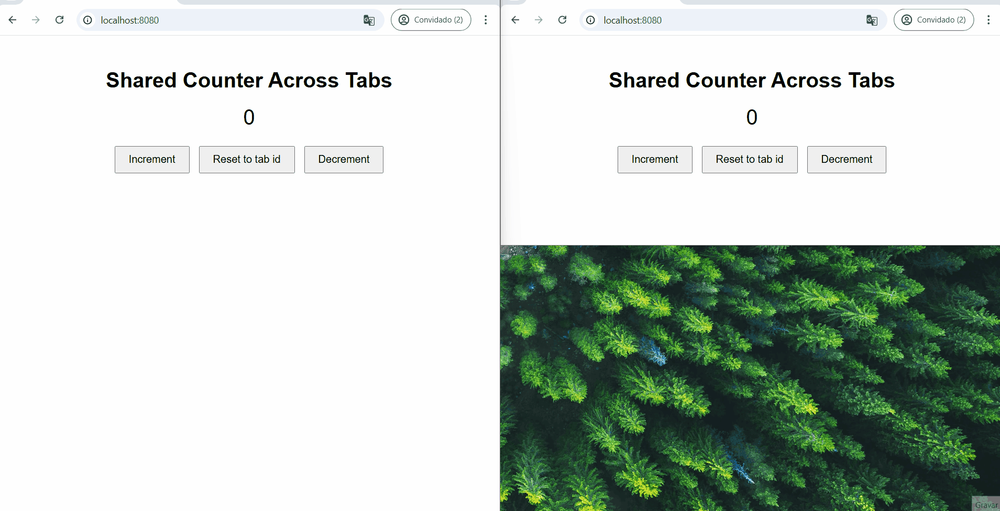

# 👨‍🎓📖 real-time-data-between-browser-tabs

Share and sync data in real-time between browser tabs with SharedWorker. It does not use localStorage, sessionStorage, cookies or indexedDB. The storage and synchronization occur on the browser (client-side).

> ⚠️ **Note**: this solution is not compatible with all browsers. See [browser compatibility.](https://developer.mozilla.org/en-US/docs/Web/API/SharedWorker#browser_compatibility)

## 🏃‍♂️TL;DR

View the website hosted on AWS S3: http://site-shared-worker.s3-website-us-east-1.amazonaws.com 

## 📁 Project Structure

```bash
public/
│   ├── index.html           # HTML Page
│   ├── shared-worker.js     # Shared worker implementation
├── docker-compose.yml       # Docker Compose configuration
├── Dockerfile               # Dockerfile for containerizing the app
├── nginx.conf               # Nginx configuration
```

## 🚀 Getting Started

### Prerequisites

- 🐳 Docker and Docker Compose installed on your machine to run in a container.
- 🟢 Node to run with NPM.

### ⚙️ Installation

Install Docker or Node.js:

[Install Docker](https://www.docker.com/) 

[Install Node](https://nodejs.org/)

Clone the repository:

```
git clone https://github.com/elidaniel92/real-time-data-between-browser-tabs.git
```

Switch to the repository folder:

```
cd real-time-data-between-browser-tabs
```

### 🐳 Running Locally with Docker

Start the app using Docker Compose.

Build the Nginx Container Image:
```
docker-compose build
```

Started the container:
```
docker-compose up
```

### 🟢 Running Locally with http-server

[http-server](https://www.npmjs.com/package/http-server) is a simple command-line static HTTP server. 

Install http-server with npm:

```
npm install --global http-server
```

Run on port 8080:

```
http-server ./public --port 8080
```

### 🎉 Open your browser and navigate to http://localhost:8080 to view the application.

#### 💡 Tip: Open multiple browser tabs side by side.




# 📜 License

This project is licensed under the MIT License - see the [LICENSE](./LICENSE) file for details.